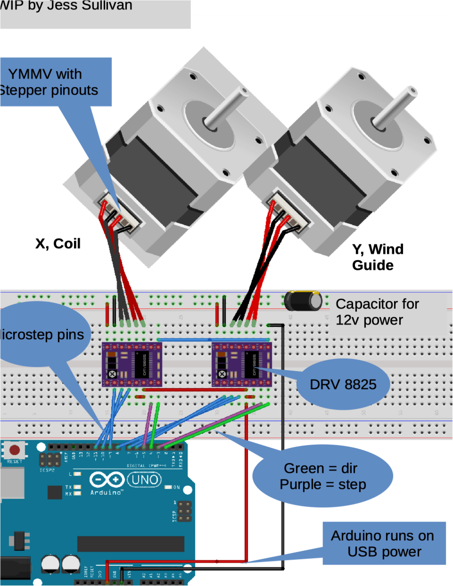

# Arduino_Coil_Winder

Use an Arduino for coil winding.  Common projects that require coils include custom step / power transformers, guitar pickups, and motors.  
This repo has been spurred by Occupy Cars “BORGI” motor R&D (https://community.occupycars.com/).  

Current hardware:

- Arduino Uno
- 2x DRV8825 stepper drivers 
- 2x NEMA 17 bipolar stepper motors

